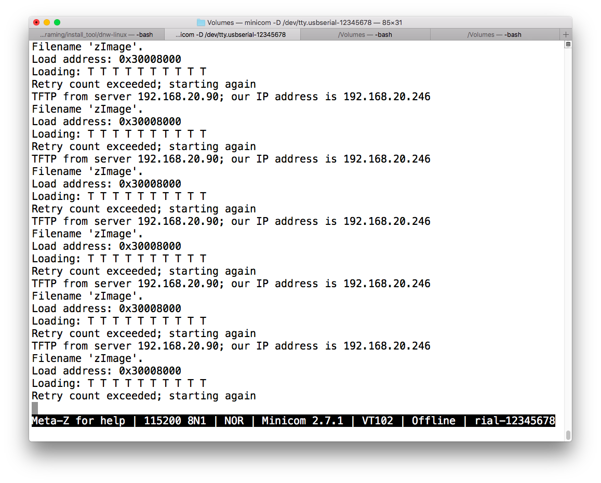

[DNW 설치(오픈 소스임)](https://github.com/changbindu/dnw-linux)

[Tera Term 설치](https://osdn.net/projects/ttssh2/releases/)


위의 두개는 윈도우 전용 극혐

[맥용 시리얼 통신](http://www.nexpert.net/463)

screen 명령어 사용해서


보드 시리얼 확인
USB <-> Serial Cable:

 제품 ID:    0x6001

  공급업체 ID:  0x0403  (Future Technology Devices International Limited)


  AX88772 :

  제품 ID:    0x772a
  공급업체 ID:  0x0b95  (ASIX Electronics Corporation)


### Minicom

맥에 minicom 설치

```shell
$ brew install minicom
```

미니콤 연결

```shell
$ ls /dev/tty*
...
/dev/tty.usbserial-12345678
...
$ sudo minicom -D /dev/tty.usbserial-12345678

```



타겟 보드 리셋 하면 이런화면 뜸


보드 리셋후  엔터 막 누른뒤에 

printenv 해주면 정보 나옴

```shell
$ ~/.getBootEnv 192.168.0.2 l2
$ ~/.getBootEnv 192.168.0.2 fw
```

이거 해서 나오는 정보를

미니콤 커맨드에 입력

